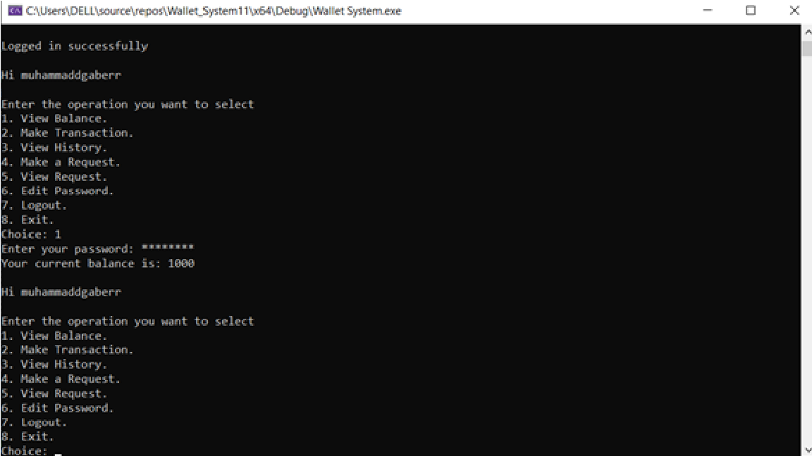

# Wallet Management System (C++)

A console-based application that simulates a **simple digital wallet system** where users can manage their balance and perform secure financial transactions.

The system allows users to create accounts, send and receive money, and track their transaction history.  
An **admin role** is also included to manage users and monitor system activity.

---

## Features

### User Features
- Register and create a wallet account
- Secure login using username and password
- View current wallet balance
- Send money to other users
- Request money from other users
- View transaction history
- Update account password
- Logout from the system

### Admin Features
- Secure admin login
- View all registered users
- View balances and transaction histories
- Add, edit, delete, or suspend user accounts
- Monitor all system transactions
- Adjust user balances when necessary

---

## Data Persistence

The system stores user accounts and transaction data using **file handling**, allowing the application to retain data even after the program is closed and reopened.

---

## Example Interface

Below is an example of the wallet system console menu:

---

## Demo Walkthrough

A step-by-step demonstration of the system flow (including screenshots) is available in the project documentation.

The demo shows:

- Account registration
- Password validation rules
- Login process
- Sending and receiving money
- Transaction history
- Password updates
- Logging in from another user account

📄 **View the full demo here:**  
[Wallet System Demo](docs/wallet-system-demo.docx)

---

## Technologies

- C++
- File Handling
- Data Structures

---

## Learning Objectives

This project focuses on:

- Applying **data structures in real systems**
- Implementing authentication and transaction logic
- Managing persistent data using files
- Practicing **problem solving and system design**
